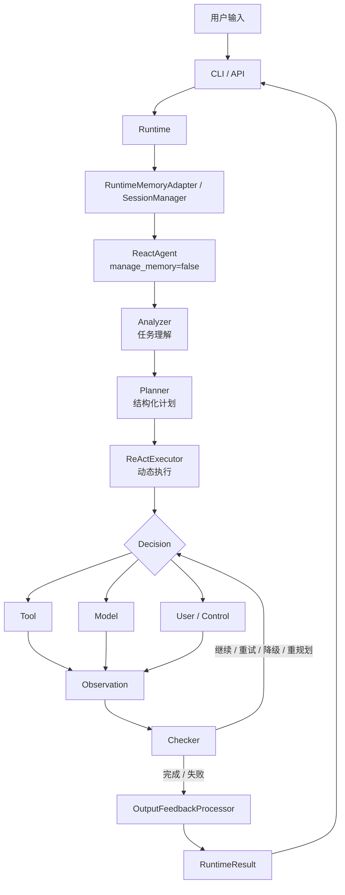
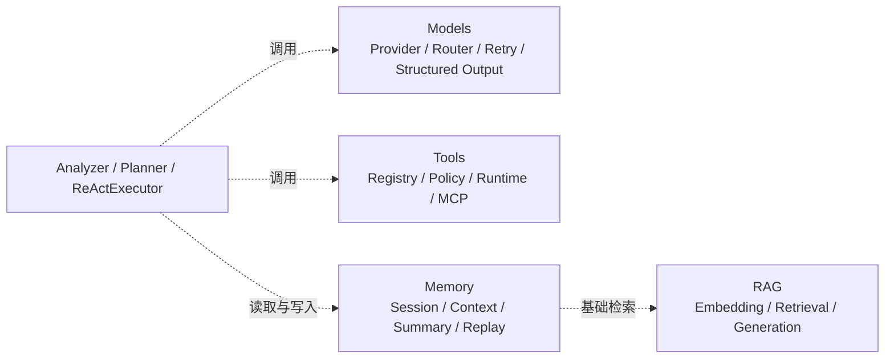

<div align="center">
  
  <h1>灵犀 Agent</h1>
  <h3>面向复杂任务的智能任务助手与 Agent Runtime 工程化实践</h3>

  <p>
    <a href="#-项目背景-background">项目背景</a> •
    <a href="#-核心亮点-highlights">核心亮点</a> •
    <a href="#-技术架构-architecture">技术架构</a> •
    <a href="#-快速开始-quick-start">快速开始</a> •
    <a href="#-项目状态-status">项目状态</a>
  </p>

  <p>
    
    
    
    
    
  </p>
</div>

---

## 📖 项目背景 (Background)

很多 Agent Demo 只能完成“用户输入 -> 调用一次大模型 -> 返回文本”，当任务变复杂后，容易出现以下问题：

- 模型无法准确理解用户意图，缺少参数时仍然盲目执行；
- 多步骤任务缺少清晰依赖，无法追踪中间结果；
- 工具调用可能产生错误、越权或不可控的副作用；
- 任务失败后无法重试、降级、暂停或恢复；
- 多轮对话上下文不断膨胀，模型调用成本和延迟增加；
- 不同模型供应商的调用协议不一致，难以替换和观测。

**灵犀 Agent** 的目标，是把一个简单的模型调用脚本，升级为具备任务理解、结构化规划、受控执行、状态持久化和过程追踪能力的任务型智能体。

它可以用于：

1. 文件读取、分析、修改和整理；
2. 联网搜索、资料总结和内容生成；
3. 文本处理、翻译、计算和文档解析；
4. 多步骤任务编排与动态重规划；
5. 通过 MCP 接入外部工具和内部系统；
6. 需要用户确认的高风险操作。

---

## 🌟 核心亮点 (Highlights)

### 1. 🧠 Planner-guided ReAct Agent

项目采用“结构化规划 + 动态执行”的混合 Agent 架构，不是让模型直接自由调用工具。

```text
用户输入
  -> Analyzer 任务理解
  -> Planner 结构化规划
  -> ReActExecutor 动态执行
  -> Tool / Model / User / Control
  -> Observation 真实观察
  -> Checker 检查与决策
  -> 完成 / 重试 / 降级 / 重规划 / 失败
```

- `Analyzer`：识别意图、参数、复杂度、风险和执行策略；
- `Planner`：生成 `TaskPlan / TaskUnit / PlanStep` 结构化任务计划；
- `ReActExecutor`：在计划约束下进行 Reasoning、Decision、Action、Observation 和 Checker 闭环；
- `ActionPacket`：用结构化协议表达工具调用、模型调用、用户确认和控制动作；
- `Checker`：根据真实执行结果决定继续、重试、fallback、询问、重规划或结束。

这种设计兼顾了固定计划的可控性和 ReAct 的动态适应能力。

### 2. 🏗️ Agent Runtime 运行环境

Runtime 作为应用级运行总管，统一处理：

- 依赖装配和生命周期管理；
- Session、AgentRun 和执行事件管理；
- RuntimeRequest / RuntimeResult 契约；
- 运行失败、取消、确认暂停和恢复；
- 中断任务启动恢复；
- 健康检查、时间线、会话导出和安全序列化。

Runtime 让 CLI、API 和 Agent 核心不需要分别实现会话写入、异常处理和任务恢复逻辑。

### 3. 🔧 统一工具协议与安全边界

工具调用统一经过以下链路：

```text
ToolCallRequest
  -> ToolRegistry 查询工具
  -> ToolPolicy 权限检查
  -> ToolRuntime 执行
  -> ToolResult 结构化返回
  -> 日志与 Observation
```

工具协议包括：

- `ToolSpec`：工具名称、描述、参数 schema、风险和能力声明；
- `ToolCallRequest`：工具调用参数、session、run、step 和 trace 信息；
- `ToolPolicy`：文件、命令、网络、MCP、确认和输出限制；
- `ToolResult`：统一表达成功、失败、错误码、是否可重试、耗时和结果数据。

安全控制包括：

- 文件路径限制在 Agent workspace 内；
- 敏感路径、越界路径和符号链接风险检查；
- 写入、删除、命令、网络和 MCP 分别设置策略；
- 高风险操作支持 preview、confirmation_id 和 preview_hash 校验；
- 命令工具优先使用结构化 argv 和 `shell=False`；
- 工具输出、Observation 和日志均有长度及敏感信息控制；
- `code_executor` 默认关闭，避免 Agent 直接执行任意代码。

### 4. 🔌 MCP 工具生态扩展

项目在 Tools 层接入 MCP，支持通过本地 STDIO MCP Server 发现和调用外部工具：

```text
配置 MCP Server
  -> 启动 STDIO 子进程
  -> initialize
  -> tools/list
  -> 动态注册 ToolSpec
  -> ReActExecutor 调用
  -> tools/call
  -> 归一化为 ToolResult
```

MCP 工具仍然必须经过 Registry、Policy、白名单、超时、输出控制和日志，不允许模型直接控制 Server 启动命令或凭据。

### 5. 🔄 会话记忆与上下文工程

Memory 层基于 SQLite 保存：

- sessions；
- messages；
- agent_runs；
- execution_events；
- summaries。

通过 `SessionManager`、`ContextBuilder` 和自动摘要实现：

- 会话隔离；
- 多轮消息持久化；
- 最近消息与历史摘要组合；
- 执行事件时间线和回放；
- 长对话上下文压缩；
- 中断任务状态恢复。

项目将“记忆”和“上下文”分开：Memory 保存完整状态，ContextBuilder 只选择当前任务需要提供给模型的信息，从而减少无关 token、延迟和调用成本。

### 6. 🌐 多模型统一接入与可观测性

Models 层通过 Provider 抽象隔离模型供应商，当前 V1 以 OpenAI-compatible 协议为主，并提供 MockModel 用于离线测试。

主要能力包括：

- Chat、Planner、ReAct、摘要、压缩和 Embedding 等调用类型；
- 结构化输出和 JSON Schema 校验；
- 有限 JSON 修复；
- 超时、重试和错误封装；
- Provider 健康检查和基础 fallback；
- provider、model、trace、latency、token、usage 和 cost 观测字段；
- 不依赖真实 API Key 的 MockModel 回归测试。

---

## 🏗️ 技术架构 (Architecture)

### 主链路



### 支撑能力层



### 目录结构

```text
agentProject/
├── main.py                         # 本地 CLI 原型入口与依赖装配
├── src/
│   ├── agent/
│   │   ├── analyzer/               # 意图、参数、复杂度与风险分析
│   │   ├── planner/                # TaskPlan、TaskUnit、PlanStep
│   │   ├── react_executor/         # ReAct 执行、检查、重试、事件和安全
│   │   └── orchestrator/           # ReactAgent 编排层
│   ├── app/
│   │   ├── runtime/                # Runtime 生命周期、恢复和结果契约
│   │   ├── api/                    # FastAPI 适配层设计与开发目录
│   │   └── cli/                    # CLI 适配层设计与开发目录
│   ├── models/                     # 模型协议、Provider、路由和观测
│   ├── tools/                      # 工具协议、运行时、策略和 MCP
│   ├── memory/                     # Session、SQLite、上下文和摘要
│   └── rag/                        # RAG 基础封装
├── tests/                          # 单元、集成和跨层验收测试
├── logs/                           # 分模块日志
├── .env.example                    # 环境变量示例
└── requirements.txt                # 依赖配置
```

---

## 🔄 核心执行流程 (Execution Flow)

以“搜索资料、总结内容并写入文件”为例：

```text
1. Analyzer
   识别 search + summarize + write_file 多意图，提取查询词和目标路径，判断写入风险。

2. Planner
   生成三个有依赖的步骤：web_search -> call_model -> write_file。

3. ReActExecutor
   校验 ActionPacket，调用搜索工具，接收真实 ToolResult。

4. Observation / Checker
   根据真实结果判断搜索是否成功；失败时重试、fallback 或请求重新规划。

5. Model
   根据搜索结果生成总结内容，输出经过结构化协议和长度控制。

6. ToolPolicy
   写入文件前进行 workspace、权限和确认检查。

7. Runtime / Memory
   保存 run、消息和执行事件，输出 RuntimeResult，并支持后续查看和恢复。
```

---

## 🛠️ 技术栈 (Tech Stack)

| 模块 | 技术选型 | 作用 |
| :--- | :--- | :--- |
| Agent Core | Python | Agent 编排、任务理解和执行引擎 |
| Agent Pattern | Planner-guided ReAct | 结构化规划与动态执行闭环 |
| Runtime | Python Runtime Contracts | 生命周期、会话、恢复和统一结果 |
| Model Layer | OpenAI-compatible Provider、MockModel | 多模型适配、结构化输出和调用观测 |
| Tool Layer | ToolRegistry、ToolPolicy、ToolRuntime | 工具注册、权限控制和统一执行 |
| Tool Protocol | MCP STDIO | 外部工具发现、动态注册和调用 |
| Memory | SQLite、SessionManager、ContextBuilder | 会话持久化、摘要、上下文和回放 |
| Retrieval | Embedding、基础 RAG 封装 | 长期记忆检索和上下文增强 |
| Testing | pytest | 单元测试、集成测试、安全回归和跨层验收 |
| Engineering | OpenSpec + SDD、OpenAI Codex | 规范驱动设计和 AI 协作开发 |

---

## 🔐 安全设计 (Security)

灵犀 Agent 遵循“模型负责提出动作，运行时负责验证和执行”的原则。

```text
模型意图
  -> ActionPacket schema 校验
  -> ToolRegistry 工具存在性检查
  -> ToolPolicy 权限和风险检查
  -> Runtime 确认边界
  -> ToolRuntime 受控执行
  -> ToolResult 真实结果
```

当前安全边界重点覆盖：

- Workspace-only 文件访问；
- 敏感路径与越界访问阻断；
- 文件写入和删除确认；
- 命令参数约束与 shell 策略；
- MCP Server 白名单与凭据隔离；
- 工具超时和输出截断；
- 结构化日志和敏感字段脱敏；
- 任意代码执行默认关闭。

> 当前实现属于工具级安全控制，不是完整的容器级代码沙箱。生产环境还需要结合 Docker、gVisor、Firecracker 或独立 Worker，增加非 root 用户、CPU/内存/磁盘/进程限制、网络隔离、文件系统隔离和任务销毁机制。

---

## 🧪 测试与验收 (Testing)

测试覆盖的主要范围：

- Analyzer 意图、参数、复杂度和风险分析；
- Planner 结构化计划、步骤依赖和规则模板；
- ReActExecutor 动作协议、执行闭环、重试、fallback、确认和重规划；
- Models 结构化输出、Provider、重试、路由和观测；
- Tools 协议、文件、命令、搜索、MCP、策略和输出控制；
- Memory 会话、SQLite、摘要、上下文、事件回放和恢复；
- Runtime 生命周期、错误、健康检查、确认恢复和跨层集成。

当前开发进度文档记录的离线回归结果为：

```text
745 passed, 4 skipped
```

该结果表示离线测试回归通过，不代表已经完成线上高并发压测、真实模型效果评测或生产级可用性验证。

运行测试：

```bash
python -m pytest -q
```

---

## 🚀 快速开始 (Quick Start)

### 环境要求

- Python 3.10+；
- pip；
- 可选：真实模型 Provider 的 API Key；
- Windows、Linux 或 macOS 均可进行本地开发。

### 1. 安装依赖

```bash
python -m venv .venv
```

Windows PowerShell：

```powershell
.\.venv\Scripts\Activate.ps1
python -m pip install -r requirements.txt
```

Linux / macOS：

```bash
source .venv/bin/activate
python -m pip install -r requirements.txt
```

### 2. 配置环境变量

复制 `.env.example` 为 `.env`，最小配置如下：

```dotenv
MODEL_NAME=mock
DEFAULT_CHAT_MODEL=mock
AGENT_WORKSPACE_ROOT=.
VECTOR_STORE_PATH=./storage/vector_store.pkl
ENABLE_CODE_EXECUTION=false
ENABLE_FILE_WRITE=true
AGENT_MODE=solo
```

默认使用 `MockModel`，不配置真实 API Key 也可以运行离线链路和测试。

### 3. 启动本地 CLI 原型

```bash
python main.py
```

启动后可以输入任务，例如：

```text
请计算 (12 + 8) * 3
请读取 README.md 并总结主要内容
请搜索 Python asyncio 的基本用法并整理成要点
```

输入 `quit`、`exit` 或 `退出` 结束会话。

### 4. 真实模型配置

项目默认以 OpenAI-compatible 协议作为模型接入主路径。使用真实 Provider 时，请通过环境变量或项目配置提供对应凭据，不要把 API Key 写入代码、配置文件或日志。

---

## 📌 项目状态 (Status)

### 已完成

- Analyzer V1 任务理解与风险策略；
- Planner V1 结构化任务计划；
- Planner-guided ReActExecutor 执行闭环；
- ActionPacket、Observation、Checker、retry、fallback 和确认恢复；
- Models V1 统一协议、结构化输出、重试和调用观测；
- Tools V1 文件、命令、搜索、文档解析和 MCP STDIO；
- Memory V1 SQLite 会话、摘要、事件时间线和恢复；
- Runtime V1 生命周期、错误处理、健康检查和结果契约；
- 大量单元测试、集成测试和安全回归测试。

### 后续增强

- 完善 FastAPI REST / WebSocket 服务化入口；
- 将 CLI 原型继续收敛为标准产品化命令；
- 补齐完整知识库导入、文档切块、metadata、引用、rerank 和 RAG 评测；
- 增加线上模型效果评测集、成本看板和真实压测；
- 将工具级安全边界升级为容器或微虚拟机级代码沙箱；
- 增加多租户、鉴权、限流、任务队列和分布式 Worker 能力。

---

## 🤝 AI 协作开发 (AI-assisted Development)

项目基于 **OpenSpec + SDD** 开发范式，并配合 **OpenAI Codex** 完成工程实现。

开发路径：

```text
问答设计
  -> 详细设计
  -> 步骤设计
  -> 开发实现
  -> 验收检查
```

- Codex：协助代码库检索、需求落地、跨文件代码生成、测试编写、联调和日志问题定位；
- 人工：负责需求澄清、架构决策、接口与安全边界设计、代码审核和最终验收；
- 设计文档：记录模块职责、输入输出、异常流程、风险约束和验收标准，使 AI 生成的实现可检查、可回归、可追踪。

---

## ⚠️ 设计边界说明 (Engineering Notes)

为了保持项目描述准确，当前仓库不将以下内容表述为已经完成的生产能力：

- 尚未完成容器级或微虚拟机级完整代码沙箱；
- 尚未完成企业级完整 RAG 数据管道和检索评测体系；
- 尚未将 LangChain Agent、n8n 工作流或 LlamaFactory LoRA 微调作为当前主链路；
- 尚未完成真实线上大规模并发压测和模型效果基准；
- 当前 Models V1 主要基于 OpenAI-compatible 协议，其他厂商原生协议需要单独适配。

---

## 📚 项目文档
- [Agent整体设计](agent整体设计.md)
- [开发方案](开发方案.md)
- [开发进度](开发进度.md)

---

## 📄 License

本项目主要用于 Agent 架构学习、工程实践和技术面试展示。具体开源许可可根据仓库发布计划补充。
