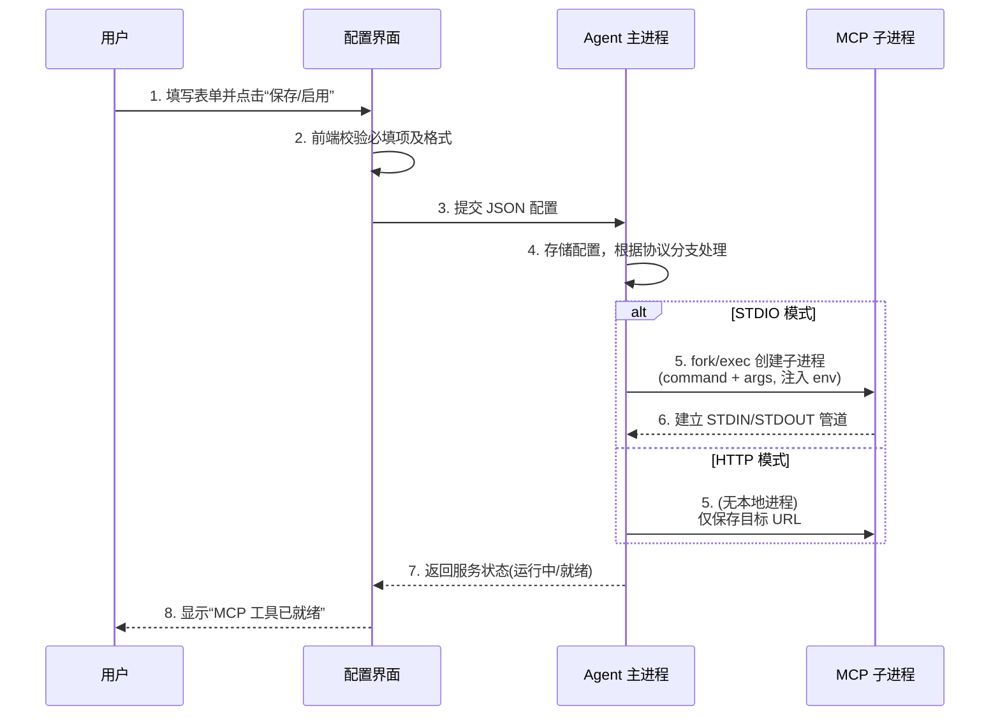

好的，既然是要“仿照 Codex 做一个这样的功能”，那我们就不能只写理论，得站在**产品功能设计**的角度，把 UI 交互、字段逻辑、校验规则都定义清楚。

以下这份文档可以直接作为你 Agent 产品中 **“自定义 MCP 工具集成”** 功能模块的 PRD（产品需求文档）或技术设计概要。

---

# 功能设计：自定义 MCP 工具集成模块

> **设计对标**：参考 Codex 的 MCP 服务器配置界面，结合我们之前讨论的底层原理，为 Agent 平台设计一个易用、专业且具备容错能力的扩展工具配置中心。

## 1. 设计目标

- **低门槛**：用户无需编写代码，通过表单配置即可接入任何 MCP 兼容服务器。
- **高灵活性**：同时支持 **STDIO（本地进程）** 与 **SSE/HTTP（远程网络）** 两种通信模式。
- **标准化**：严格遵循 MCP 协议规范，确保与社区数千个现有 MCP 服务（MySQL、Filesystem、Git 等）无缝兼容。

## 2. 整体界面布局与功能分区

参考 Codex 的设计，配置表单建议划分为 **四大区域**：

| 区域 | 核心字段 | 交互说明 |
| :--- | :--- | :--- |
| **1. 基础信息区** | 服务名称、通信协议切换 | 定义该工具在 Agent 中的唯一身份。 |
| **2. 本地启动配置区** | 启动命令、参数列表（数组） | **仅在 STDIO 模式下显示**，定义如何拉起本地子进程。 |
| **3. 连接目标配置区** | **仅在 HTTP 模式下显示**的 URL 地址、请求头 | 定义要访问的外部 MCP 服务端点。 |
| **4. 环境与上下文区** | 环境变量（键值对）、工作目录、变量传递开关 | 定义子进程运行时的上下文环境。 |

## 3. 详细配置项设计逻辑

### 3.1 基础信息区
- **服务名称 (Name)**：
    - **逻辑**：必填，仅支持字母、数字、下划线。作为 Agent 内部路由的 Key。
    - **规则**：不可与已有名称重复。
- **通信协议 (Transport)**：
    - **UI 表现**：`STDIO` | `流式 HTTP` （单选按钮/切换开关）。
    - **逻辑**：**该字段决定下方“启动配置区”的显隐**。
        - 选 `STDIO`：显示“启动命令”、“参数”、“工作目录”等进程控制字段。
        - 选 `流式 HTTP`：**隐藏**上述进程字段，切换显示为“Endpoint URL”、“Headers”等网络请求字段。

### 3.2 本地启动配置区（仅 STDIO 模式）
- **启动命令 (Command)**：
    - **逻辑**：必填。指定可执行文件（如 `npx`, `python`, `uv`, `/usr/bin/node`）。
    - **校验**：后端需校验该命令在当前系统 PATH 中是否存在（如不存在，前端提示警告但允许保存，以便离线环境预装）。
- **参数 (Args)**：
    - **交互约束（关键点）**：
        - **必须提供多个输入框（多行列表）**，每个输入框代表一个独立参数。
        - **严禁**使用单行文本框让用户用逗号或空格隔开（如 `-y, package` 是无效的）。
    - **逻辑**：后端拼接命令时，严格按数组顺序追加（对应底层 `execvp` 的 argv）。

### 3.3 网络请求配置区（仅 HTTP 模式）
- **服务 URL (Endpoint)**：
    - **逻辑**：必填。填写外部 MCP 服务的完整地址（如 `https://api.example.com/mcp/sse`）。
    - **校验**：格式需符合 URL 规范。
- **请求头 (Headers)**：
    - **逻辑**：键值对列表。支持配置 `Authorization: Bearer xxx` 等鉴权信息，用于访问受保护的外部服务。

### 3.4 环境与上下文区（两种模式均支持）
- **环境变量 (Env)**：
    - **逻辑**：键值对列表。后端在启动子进程时注入。
    - **典型用途**：`MYSQL_HOST`, `API_KEY`, `PATH` 等配置信息传递。
- **环境变量传递 (Pass Env)**：
    - **逻辑**：开关（默认开启）。开启后，Agent 主进程的 `PATH`、`HOME` 等系统变量将合并传递给子进程。关闭则仅保留手动填写的环境变量，提供隔离运行环境。
- **工作目录 (Working Directory)**：
    - **逻辑**：指定子进程的 `cwd`（当前工作目录）。支持绝对路径或相对路径（相对于 Agent 进程）。影响相对路径文件的读取。

## 4. 核心交互逻辑与状态流转

以下是用户配置并启动一个 MCP 服务的完整时序流程：



## 5. 关键容错与边界场景处理（FAQ 形式归档）

为了提升产品体验，设计文档中需明确列出以下边界场景的处理方案：

| 场景 | 产品表现/处理逻辑 |
| :--- | :--- |
| **本地未装 Node.js 却配置了 `npx`** | Agent 启动子进程时捕获 `ENOENT`（命令未找到）错误，前端提示：“**启动失败：未找到 npx 命令，请确保已安装 Node.js 并配置环境变量。**” |
| **MCP 服务连不上 MySQL（连接被拒）** | 子进程会向 `stderr` 输出错误日志。Agent 需监听 `stderr` 并透传给前端，提示：“**服务报错：无法连接到 127.0.0.1:3306，请检查数据库地址或网络。**” |
| **STDIO 模式误填了外部 IP** | **这是设计限制**。若用户想访问外部服务，必须切换为“流式 HTTP”模式并填写 URL。若在 STDIO 模式下填写远程路径，系统应给出 Tooltip 提示：“STDIO 仅支持本地命令启动，如需连接外部服务请切换协议。” |
| **服务名冲突** | 前端实时检测，提示“该名称已被占用，请修改”。 |
| **参数列表为空** | 允许为空（某些命令无参数），但命令本身必须存在。 |

## 6. 配置存储模型（JSON Schema 设计建议）

最终的配置落盘数据结构，强烈建议采用以下标准格式（兼容 MCP 官方规范）：

```json
{
  "mcpServers": {
    "mysql_xf": {
      "transport": "stdio",          // 或 "sse"
      "command": "npx",
      "args": ["-y", "@pig4cloud/mcp-mysql-server"],
      "env": {
        "MYSQL_HOST": "127.0.0.1",
        "MYSQL_USER": "root",
        "MYSQL_PASSWORD": "123mysql"
      },
      "cwd": "~/code",
      "passEnv": true
    }
  }
}
```

> **设计约束**：储存时必须使用数组存储 `args`，这是确保命令解析不出错的技术底线。

## 7. 扩展性思考（后续迭代预留）

当前设计已可覆盖 90% 的日常使用场景，后续可考虑引入：

- **预置模板市场**：内置 MySQL、PostgreSQL、Filesystem 等常用 MCP 模板，用户一键导入（自动填入 `command`, `args` 和默认 `env` 字段）。
- **日志查看器**：在 UI 上提供一个控制台面板，实时展示 MCP 子进程的 `stdout` 和 `stderr`，方便高级用户调试。


这份设计稿直接拷贝到你的 Word/飞书/Notion 文档里，开发同学就能看明白了。核心要点都做了表格化和结构化处理，尤其是 **Args 必须拆分为数组**、**STDIO 与 HTTP 的显示切换逻辑**，以及 **本地 MySQL 不存在只是连接报错而非服务未找到**这几个我们重点讨论过的坑，都作为关键约束写进去了。如果还需要补充 UI 原型图或更详细的 API 接口定义，随时可以接着聊。👍